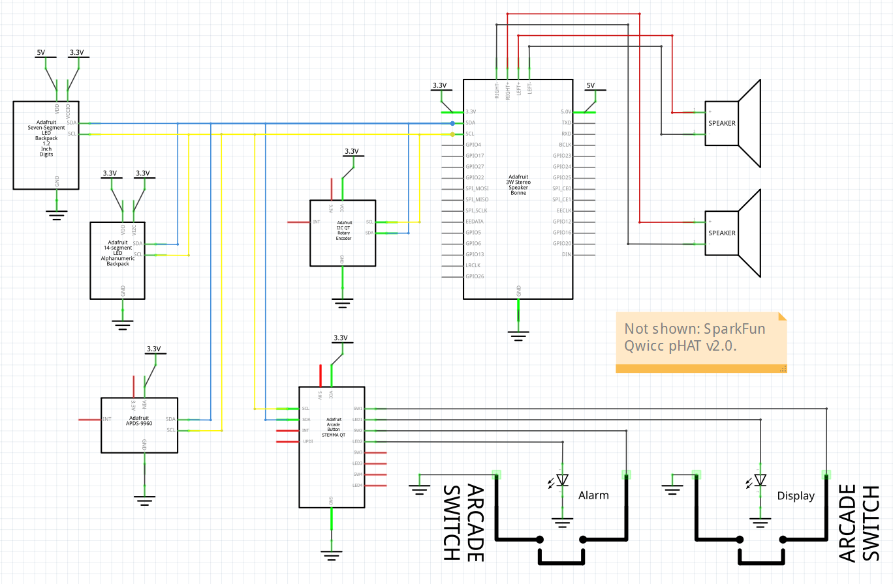

# Alarm-Clock  
Personal project. Not fully baked. UI is not great. Code is not very well written and is unclear.  
Raspberry Pi based alarm clock with 7-segment display.  
  
Schematic  

## Features  
1. Dimmable
2. Choose alarm sound and initial volume
3. Alarm starts quietly and gradually gets louder
4. Wave to snooze and cancel alarms
5. Automatically dim and then turn off the display at preset times
5. Wave to wake the display when it is off
 

## Operation  
The alarm clock is controlled using a rotary encoder (with push button) and two additional pushbuttons: one for Alarm Settings and one for Display Settings. The LED displays show the current time, alarm settings, and other status information.

### Normal Time Display
- **Default Mode:** The numeric display shows the current time in HH:MM format. The colon blinks every second.
- **Brightness:** The display brightness is manually controlled and can optionally be set to be automatically dimmed and then turned off based on time of day.

### Setting the Alarm
1. **Enter Alarm Setting Mode:**
   - Press the **Alarm Settings** button.
   - The alphanumeric display will show the alarm time or setting currently being adjusted.
2. **Adjust Alarm Hour:**
   - Rotate the encoder clockwise to increase the hour, counterclockwise to decrease.
   - Press the encoder button to move to minute adjustment.
3. **Adjust Alarm Minute:**
   - Rotate the encoder to set the minutes.
   - Press the encoder button to move to AM/PM selection.
4. **Set AM/PM:**
   - Rotate the encoder to toggle between AM and PM.
   - Press the encoder button to move to alarm ON/OFF selection.
5. **Turn Alarm ON/OFF:**
   - Rotate the encoder to toggle the alarm status.
   - Press the encoder button to finish and return to normal display.
6. - **Select Alarm Track:** Press the encoder to cycle to alarm track selection, then rotate to choose a track.
7. - **Adjust Volume:** Press again to cycle to volume adjustment, then rotate to set volume.

### Display Settings
- **Enter Display Settings:** Press the **Display Settings** button.
- **Adjust Brightness:** In Display Settings mode, rotate the encoder to change manual brightness.
- **Display Override:** Press again to select display override ON/OFF. Setting to On will cause the display to not turn off or dim automatically. 

### Alarm Operation
- **Alarm Ringing:** When the alarm time is reached and the alarm is ON, the display will show "RING" and the alarm will sound (if audio is enabled).
- **Snooze:** Wave your hand in front of the EDS sensor to snooze the alarm for 5 minute.
- **Turn Off Alarm:** Press the alarm or rotary encoder button to turn off the alarm.

### Display Modes
- **Manual/Auto Dim:** The display automatically dims or turns off at night, or you can manually adjust brightness in Display Settings mode.
- **Wake Display:** If the display is off, wave your hand in front of the EDS sensor to temporarily wake it.

### Persistent Storage
- **Automatic Saving:** Alarm and display settings (such as alarm time, brightness, alarm track, volume, and auto dim/off display) are automatically saved to persistent storage. Settings are restored after a power cycle or reboot.

### Notes
- All settings and states are displayed on the alphanumeric display.
- For more details on wiring, setup, or troubleshooting, see the rest of this README or the code comments.

## Parts List
1. 1 x Raspberry Pi Model Zero 2 W
2. 1 x SparkFun Qwiic pHAT v2.0 for Raspberry Pi - STEMMA QT / Qwiic PID: 5142
3. 1 x USB power supply for Raspberry Pi
4. 1 x Adafruit 1.2" 4-Digit 7-Segment Display w/I2C Backpack - Yellow. Product ID: 1269
5. 1 x Adafruit Quad Alphanumeric Display - Red 0.54" Digits w/ I2C Backpack - STEMMA QT / Qwiic. Product ID: 1911
6. 1 x Adafruit I2C Stemma QT Rotary Encoder Breakout with Encoder - STEMMA QT / Qwiic PN 5880
7. 1 x Adafruit APDS9960 Proximity, Light, RGB, and Gesture Sensor - STEMMA QT / Qwiic PID: 3595
8. 1 x Adafruit I2S 3W Stereo Speaker Bonnet for Raspberry Pi - Mini Kit PID: 3346
9. 1 x Stereo Enclosed Speaker Set - 3W 4 Ohm PID: 1669
10. Stacking Header for Pi A+/B+/Pi 2/Pi 3 - 2x20 Extra Tall Header PID: 1979
11. 1 x Adafruit LED Arcade Button 1x4 - STEMMA QT I2C Breakout - STEMMA QT / Qwiic PID: 5296
12. 1 x Mini LED Arcade Button - 24mm Translucent Clear PID: 3429
13. 1 x Mini LED Arcade Button - 24mm Translucent Yellow PID: 3431
14. 4 x Arcade Button Quick-Connect Wire Pairs - 0.11" Product ID: 1152
15. 3 x 7" male x male Stemma QT cable
16. 1 x 6" male x female DuPont connector Stemma QT cable
17. 1 x 6" male x female DuPont connector Stemma QT cable modified with additional DuPont female connector.
18. 1 x 6" DuPont female x 0.1" pin (for 7-Segment 5v power)
